# HAMNET-RELAY — Architecture Build & Testing Roadmap
> Single-binary HAM radio data relay middleware · Rust · AX.25 / AFSK · RustChan integration  
> Progression: simple serial loopback → full RustChan real-time data streaming

---

## Overview: Build Phase Map

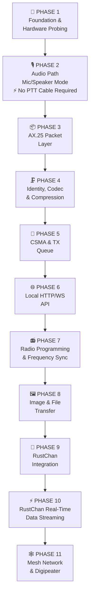

---

## Phase 1 — Foundation & Hardware Probing

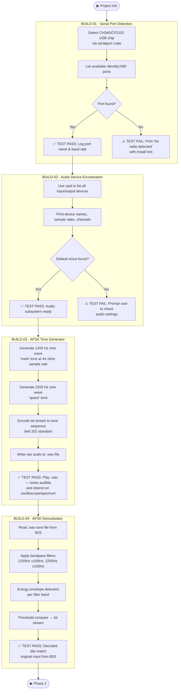

---

## Phase 2 — Audio Path · Mic/Speaker Mode (No PTT Cable Required)

> **🎙️ This phase enables the app to work with ZERO hardware beyond the radio itself.**  
> The computer's microphone listens to the radio speaker. The computer's speakers (or headphone jack into the radio's mic socket) transmit audio.  
> This lets anyone set a radio on a desk, tune it to a frequency, and have the computer receive and decode all traffic passively — or key-up manually via VOX.

```mermaid
flowchart TD
    PHASE2([▶ Phase 2 Entry]) --> B05

    subgraph B05["BUILD-05 · Microphone Capture Input Stream"]
        B05A[Open system default mic via cpal\nInput stream, 44.1kHz mono] --> B05B[Capture ring buffer — 512 sample chunks]
        B05B --> B05C[Pipe buffer → AFSK demodulator from B04]
        B05C --> B05D[✅ TEST PASS: Speak 'dit dah' into mic —\nbits appear in stdout]
    end

    B05D --> B06

    subgraph B06["BUILD-06 · Speaker Output Stream"]
        B06A[Generate AFSK audio for test payload] --> B06B[Open system default output via cpal\nOutput stream, 44.1kHz mono]
        B06B --> B06C[Play tones through speakers\nor 3.5mm headphone-to-radio-mic cable]
        B06C --> B06D[✅ TEST PASS: Another SDR or radio\ndecodes the AFSK tones correctly]
    end

    B06D --> B07

    subgraph B07["BUILD-07 · VOX Level Detection\n(Auto Carrier Sense via Mic)"]
        B07A[Monitor mic input RMS level\nin sliding 50ms window] --> B07B{RMS above squelch\nthreshold?}
        B07B -- Yes --> B07C[Signal ACTIVE — radio is transmitting\nBlock our own TX]
        B07B -- No --> B07D[Channel CLEAR — safe to transmit]
        B07C --> B07E[✅ TEST: Play audio from one speaker,\nconfirm detection fires correctly]
        B07D --> B07E
    end

    B07E --> B08

    subgraph B08["BUILD-08 · Full Mic/Speaker Loopback End-to-End\n🔑 KEY MILESTONE — Radio on Desk Mode"]
        B08A["🎙️ Radio set to receive frequency\nComputer mic pointed at radio speaker"] --> B08B[Radio receives over-air packet\nfrom another station]
        B08B --> B08C[Mic captures audio from radio speaker]
        B08C --> B08D[cpal stream → AFSK demod → bit decode]
        B08D --> B08E[Print decoded text to stdout]
        B08E --> B08F["✅ TEST PASS: Any AX.25/APRS packet\non the frequency is decoded in terminal\n⭐ USER CAN LISTEN TO RADIO WITHOUT ANY CABLE"]
        B08F --> B08G["📤 TX PATH: Encode payload → AFSK tones\n→ play through speakers\n→ radio mic jack picks up audio\n→ (user manually keys PTT or radio uses VOX)"]
        B08G --> B08H["✅ TEST PASS: Remote station receives\nand decodes our transmission\n⭐ FULLY WIRELESS SETUP — NO PTT CABLE NEEDED"]
    end

    B08H --> B09_NOTE["📝 NOTE: PTT cable support added in Phase 3\nas an optional enhancement. Mic/Speaker\npath remains supported throughout all builds."]
    B09_NOTE --> PHASE3([▶ Phase 3])
```

---

## Phase 3 — AX.25 Packet Layer

```mermaid
flowchart TD
    PHASE3([▶ Phase 3 Entry]) --> B09

    subgraph B09["BUILD-09 · AX.25 Frame Assembler"]
        B09A[Define AX.25 frame struct:\nsrc_callsign, dst_callsign, payload, flags] --> B09B[Implement bit-stuffing per AX.25 spec]
        B09B --> B09C[Compute CRC-16-CCITT\nFCS field]
        B09C --> B09D[Serialize frame to byte Vec]
        B09D --> B09E[✅ TEST: Feed output to\nDirewolf decode — frame accepted]
    end

    B09E --> B10

    subgraph B10["BUILD-10 · PTT Control via RTS/DTR Pin\n(Optional Hardware Path)"]
        B10A["🔌 Detect if PTT cable is connected\n(CHIRP-compatible USB cable)"] --> B10B{Cable detected?}
        B10B -- Yes --> B10C[Assert RTS high → PTT engaged\nAssert RTS low → PTT released]
        B10B -- No --> B10D["⚙️ Fall back to Mic/Speaker path\n(Phase 2 — no cable needed)"]
        B10C --> B10E[✅ TEST: PTT LED on radio\nflashes on RTS toggle]
        B10D --> B10E
    end

    B10E --> B11

    subgraph B11["BUILD-11 · Packet TX Pipeline"]
        B11A[Payload string input] --> B11B[AX.25 frame assemble\nwith source callsign]
        B11B --> B11C[AFSK modulate → audio buffer]
        B11C --> B11D{PTT cable available?}
        B11D -- Yes --> B11E[Assert RTS → play audio → release RTS]
        B11D -- No --> B11F[Play audio via speaker\nUser or radio VOX keys PTT]
        B11E --> B11G[✅ TEST: Remote station\ndecodes 'HELLO WORLD']
        B11F --> B11G
    end

    B11G --> B12

    subgraph B12["BUILD-12 · Packet RX Pipeline"]
        B12A{Input source?} --> B12B["🎙️ Mic stream (Phase 2 path)"]
        B12A --> B12C["🔌 Radio audio jack\nvia USB sound card"]
        B12B --> B12D[AFSK demodulate → bit stream]
        B12C --> B12D
        B12D --> B12E[AX.25 frame disassemble]
        B12E --> B12F[CRC validate]
        B12F --> B12G{CRC pass?}
        B12G -- Yes --> B12H[Extract callsign + payload\nPrint to stdout]
        B12G -- No --> B12I[Discard + log CRC error]
        B12H --> B12J[✅ TEST: Send from APRS client,\nreceive here with correct callsign]
    end

    B12J --> B13

    subgraph B13["BUILD-13 · Duplex Test — Full TX/RX Loop"]
        B13A[Station A sends 'PING seq=1'] --> B13B[Station B receives + decodes]
        B13B --> B13C[Station B sends 'PONG seq=1']
        B13C --> B13D[Station A receives + decodes]
        B13D --> B13E[✅ TEST PASS: Round-trip packet\nconfirmed both directions]
    end

    B13E --> PHASE4([▶ Phase 4])
```

---

## Phase 4 — Identity, Codec & Compression

```mermaid
flowchart TD
    PHASE4([▶ Phase 4 Entry]) --> B14

    subgraph B14["BUILD-14 · Client Identity System"]
        B14A[Check ~/.config/hamnet-relay/config.toml\nfor existing identity seed] --> B14B{Seed exists?}
        B14B -- No --> B14C[Generate 256-bit random seed\nWrite to config.toml]
        B14B -- Yes --> B14D[Load seed from config]
        B14C --> B14E[Compute Blake3 hash of seed\n= identity hash]
        B14D --> B14E
        B14E --> B14F[Truncate to first 8 bytes\nfor packet headers]
        B14F --> B14G[✅ TEST: Re-run app — same\nhash reproduced from saved seed]
    end

    B14G --> B15

    subgraph B15["BUILD-15 · MessagePack Serialization"]
        B15A[Define PostPayload struct:\nthread_id, board_id, text, image_opt,\nseq_num, identity_hash, callsign] --> B15B[Serialize via rmp-serde → bytes]
        B15B --> B15C[Deserialize bytes back → struct]
        B15C --> B15D[✅ TEST: Round-trip serialize/deserialize\nall fields match]
    end

    B15D --> B16

    subgraph B16["BUILD-16 · zstd Compression"]
        B16A[Take serialized MessagePack bytes] --> B16B[zstd::encode_all\ncompression level 3]
        B16B --> B16C[Log original vs compressed size]
        B16C --> B16D[zstd::decode_all → decompress]
        B16D --> B16E[✅ TEST: 1KB text payload\ncompresses to <200 bytes]
    end

    B16E --> B17

    subgraph B17["BUILD-17 · Full Payload Codec Pipeline"]
        B17A[PostPayload struct] --> B17B[MessagePack serialize]
        B17B --> B17C[zstd compress]
        B17C --> B17D[Prepend header:\nidentity hash 8B + seq_num 4B + checksum 4B]
        B17D --> B17E[AX.25 frame wrap]
        B17E --> B17F[AFSK modulate]
        B17F --> B17G[TX via speaker or PTT cable]
        B17G --> B17H["✅ TEST: Remote station receives\npost text with callsign intact\nAll fields decoded correctly"]
    end

    B17H --> PHASE5([▶ Phase 5])
```

---

## Phase 5 — CSMA & TX Queue

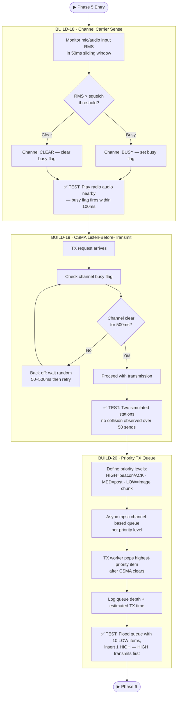

---

## Phase 6 — Local HTTP/WebSocket API

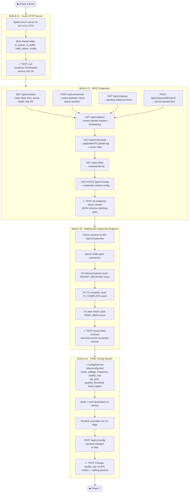

---

## Phase 7 — Radio Programming & Frequency Sync

```mermaid
flowchart TD
    PHASE7([▶ Phase 7 Entry]) --> B25

    subgraph B25["BUILD-25 · CHIRP Protocol / Baofeng Programming"]
        B25A[Detect radio on serial port] --> B25B[Send CHIRP init sequence\nvia serialport crate]
        B25B --> B25C[Write channel entry:\nfreq_mhz, offset_mhz, ctcss, power]
        B25C --> B25D[Confirm write with readback]
        B25D --> B25E[✅ TEST: Radio displays programmed\nfrequency after sequence completes]
    end

    B25E --> B26

    subgraph B26["BUILD-26 · Band Plan Validation"]
        B26A[Embed ITU Region 1/2/3 +\nFCC Part 97 sub-band lookup table] --> B26B[On config/programming: check freq\nagainst region table]
        B26B --> B26C{Freq in valid\nham band?}
        B26C -- Yes --> B26D[✅ Proceed]
        B26C -- No --> B26E[⚠️ Warn user — frequency is out-of-band\nfor configured region. Not blocked, advisory only.]
    end

    B26D --> B27
    B26E --> B27

    subgraph B27["BUILD-27 · Server Beacon TX"]
        B27A[Server starts → programs radio] --> B27B[Every 10 min: assemble BEACON frame]
        B27B --> B27C["Beacon payload: freq, mode, baud,\nserver identity hash, callsign (REQUIRED by FCC)"]
        B27C --> B27D[Push beacon to HIGH priority\nTX queue]
        B27D --> B27E[✅ TEST: Beacon received and decoded\nby test station every 10 min]
    end

    B27E --> B28

    subgraph B28["BUILD-28 · Client Beacon RX & Sync"]
        B28A[Client listens on default/config freq\nfor BEACON frame type] --> B28B[Receive and decode beacon]
        B28B --> B28C[Extract server freq params]
        B28C --> B28D[Program own radio to match\nvia CHIRP sequence]
        B28D --> B28E[Transmit SYNC_ACK frame\nwith client identity hash + callsign]
        B28E --> B28F[✅ TEST: Client auto-tunes radio\nand sends ACK within 30s of beacon]
    end

    B28F --> B29

    subgraph B29["BUILD-29 · Full Sync Handshake & Peer Registry"]
        B29A[Server receives SYNC_ACK] --> B29B[Register client:\nhash → last_seen, callsign, freq_confirmed]
        B29B --> B29C[Server sends SYNC_CONFIRM\nwith session params]
        B29C --> B29D[Data exchange authorized]
        B29D --> B29E[✅ TEST: /api/v1/peers returns\nclient entry after handshake completes]
    end

    B29E --> PHASE8([▶ Phase 8])
```

---

## Phase 8 — Image & File Transfer

```mermaid
flowchart TD
    PHASE8([▶ Phase 8 Entry]) --> B30

    subgraph B30["BUILD-30 · Image Quality Tier System"]
        B30A[Input: raw image file] --> B30B[Read quality tier from config/request:\nTIER 1 / 2 / 3]
        B30B --> B30C{Tier}
        B30C -- TIER 1 --> B30D["64×64px · JPEG 30%\n~2KB · ~15s TX"]
        B30C -- TIER 2 --> B30E["128×128px · JPEG 60%\n~8KB · ~55s TX"]
        B30C -- TIER 3 --> B30F["256×256px · JPEG 85%\n~25KB · ~3min TX"]
        B30D --> B30G[Encode via image crate → JPEG bytes]
        B30E --> B30G
        B30F --> B30G
        B30G --> B30H[zstd compress JPEG bytes]
        B30H --> B30I[✅ TEST: Output size within expected\nbandwidth budget for tier]
    end

    B30I --> B31

    subgraph B31["BUILD-31 · Image TX Over Radio"]
        B31A[Compressed image bytes] --> B31B[Split into 256-byte chunks]
        B31B --> B31C[Each chunk gets seq_num + total_chunks\n+ crc32 checksum]
        B31C --> B31D[AX.25 wrap each chunk]
        B31D --> B31E[Queue all chunks in TX queue]
        B31E --> B31F[Transmit with CSMA between each chunk]
        B31F --> B31G[✅ TEST TIER 1: 64×64 image received\nand reconstructed within 20s]
    end

    B31G --> B32

    subgraph B32["BUILD-32 · Chunked File Transfer Protocol"]
        B32A[Any file input → zstd compress] --> B32B[Split into 256-byte chunks\nwith chunk_index + total_chunks]
        B32B --> B32C[Transmit FILE_HEADER frame first:\nfilename, total_size, total_chunks, hash]
        B32C --> B32D[Transmit DATA chunks sequentially]
        B32D --> B32E[Transmit FILE_EOF frame]
        B32E --> B32F[Receiver reassembles chunks\nto output directory]
        B32F --> B32G[✅ TEST: 10KB text file transferred,\nreassembled, hash matches]
    end

    B32G --> B33

    subgraph B33["BUILD-33 · ACK/NACK Retransmit"]
        B33A[Receiver sends ACK per chunk\nor NACK with missing seq_nums] --> B33B{NACK received?}
        B33B -- Yes --> B33C[Re-queue missing chunks\nat HIGH priority]
        B33C --> B33A
        B33B -- No → All ACKd --> B33D[Transfer complete]
        B33D --> B33E[✅ TEST: Simulate 20% packet loss —\nall chunks eventually retransmitted]
    end

    B33E --> B34

    subgraph B34["BUILD-34 · File Reassembly & Storage"]
        B34A[All chunks received for a transfer] --> B34B[Decompress zstd → original bytes]
        B34B --> B34C[Verify Blake3/SHA3 hash\nagainst FILE_HEADER]
        B34C --> B34D{Hash valid?}
        B34D -- Yes --> B34E[Write to ~/hamnet-relay/received/\nwith source callsign prefix]
        B34D -- No --> B34F[Discard + send NACK for all chunks\nRequest full retransmit]
        B34E --> B34G[Emit PACKET_RECEIVED event\nvia WebSocket to subscribers]
        B34G --> B34H[✅ TEST: File on disk matches\noriginal byte-for-byte]
    end

    B34H --> PHASE9([▶ Phase 9])
```

---

## Phase 9 — RustChan Integration

```mermaid
flowchart TD
    PHASE9([▶ Phase 9 Entry]) --> B35

    subgraph B35["BUILD-35 · RustChan Incoming Webhook\n[RustChan: NEW endpoint]"]
        B35A["RustChan adds:\nPOST /api/hamnet/incoming"] --> B35B["Accepts: { text, thread_id, board_id,\ncallsign, identity_hash, image_b64_opt }"]
        B35B --> B35C[Authenticates via shared local secret\nenv var HAMNET_SECRET]
        B35C --> B35D[Creates post in database\nas if submitted normally]
        B35D --> B35E[✅ TEST: curl POST to endpoint\npost appears on board with correct content]
    end

    B35E --> B36

    subgraph B36["BUILD-36 · HAM Source Badge on Posts\n[RustChan: NEW DB fields + UI]"]
        B36A["Add nullable columns to posts table:\nham_source_hash TEXT\nham_callsign TEXT"] --> B36B["UI: render 📻 via HAM badge\non posts where ham_callsign IS NOT NULL"]
        B36B --> B36C[Show truncated identity hash\n+ callsign in badge tooltip]
        B36C --> B36D[✅ TEST: HAM-received post\nshows badge; normal post does not]
    end

    B36D --> B37

    subgraph B37["BUILD-37 · Thread Watch / Subscription API\n[RustChan: NEW endpoint]"]
        B37A["RustChan adds:\nGET /api/threads/{id}/updates?since={ts}"] --> B37B[Returns new posts for thread\nsince given timestamp or post_id]
        B37B --> B37C[HAMNET-RELAY polls this endpoint\non configured interval per watched thread]
        B37C --> B37D[New posts queued for radio TX\nat appropriate quality tier]
        B37D --> B37E[✅ TEST: Post to watched thread —\nHAMNET-RELAY logs 'queued for TX' within poll interval]
    end

    B37E --> B38

    subgraph B38["BUILD-38 · Outbound Hook on Post Submit\n[RustChan: MODIFY submit handler]"]
        B38A[User submits post to HAM-enabled board] --> B38B{Board is\nHAM-enabled?}
        B38B -- Yes --> B38C["Async fire-and-forget:\nPOST /api/v1/transmit to HAMNET-RELAY\nDo NOT block post submission on this"]
        B38B -- No --> B38D[Normal post submit only]
        B38C --> B38E[✅ TEST: Submit post to HAM board\n→ TX queue gains new item immediately]
        B38D --> B38E
    end

    B38E --> B39

    subgraph B39["BUILD-39 · RustChan Admin Config Panel\n[RustChan: MODIFY admin UI]"]
        B39A["Add [hamnet] section to RustChan config:\nrelay_url, api_key, enabled_boards[]\nauto_push, auto_pull, pull_interval_secs"] --> B39B[Admin panel UI section:\ntoggle HAM per board, set relay URL/key]
        B39B --> B39C[Config stored in TOML or admin DB table]
        B39C --> B39D[✅ TEST: Disable HAM on board —\nTX hook no longer fires for that board]
    end

    B39D --> B40

    subgraph B40["BUILD-40 · Callsign / Identity Association\n[RustChan: NEW user settings field]"]
        B40A[User settings page: optional FCC callsign field] --> B40B[Callsign stored per account\nor per-session field at TX time]
        B40B --> B40C[Included in outbound HAMNET packet\ncallsign field of AX.25 frame]
        B40C --> B40D[✅ TEST: Submit post with callsign set —\nreceiving station sees correct callsign in packet]
    end

    B40D --> PHASE10([▶ Phase 10])
```

---

## Phase 10 — RustChan Real-Time Data Streaming

```mermaid
flowchart TD
    PHASE10([▶ Phase 10 Entry]) --> B41

    subgraph B41["BUILD-41 · WebSocket Push: HAMNET-RELAY → RustChan"]
        B41A[RustChan connects to\nWS /api/v1/subscribe on HAMNET-RELAY] --> B41B[HAMNET-RELAY pushes PACKET_RECEIVED\nevents to RustChan in real-time]
        B41B --> B41C[RustChan handler creates post\non every inbound packet event]
        B41C --> B41D[✅ TEST: Transmit from remote station —\npost appears on RustChan board\nwithin seconds of receipt]
    end

    B41D --> B42

    subgraph B42["BUILD-42 · Streaming Post Flow — Full Pipeline"]
        direction LR
        B42A[Remote HAM station\nwith hamnet-relay client] -->|"AFSK over RF"| B42B[Server radio\nreceives signal]
        B42B -->|"mic/speaker or\naudio jack"| B42C[hamnet-relay\nAFSK demod + AX.25 unpack]
        B42C -->|"WS PACKET_RECEIVED event"| B42D[RustChan\nWebSocket handler]
        B42D -->|"POST /api/hamnet/incoming"| B42E[Post created in DB\nwith 📻 via HAM badge]
        B42E -->|"SSE/WS push to browser"| B42F[RustChan board\nupdates in real-time for\nall connected users]
        B42F --> B42G[✅ END-TO-END TEST:\nPost sent by remote HAM operator\nappears on board within 10s]
    end

    B42G --> B43

    subgraph B43["BUILD-43 · Image Pipeline Quality-Tier Awareness\n[RustChan: MODIFY image handler]"]
        B43A[RustChan exposes image dimensions\n+ original file size in API response] --> B43B[HAMNET-RELAY reads these metadata fields]
        B43B --> B43C[Selects quality tier based on:\nfile size, server quality_cap config]
        B43C --> B43D[Pre-scales if over tier limit\nor passes to relay's codec]
        B43D --> B43E[Option: Store ham_thumbnail variant\nin RustChan DB]
        B43E --> B43F[✅ TEST: Large image auto-downscaled\nto TIER 1 before TX when server cap = 1]
    end

    B43F --> B44

    subgraph B44["BUILD-44 · Radio Status Widget in RustChan\n[RustChan: OPTIONAL admin UI widget]"]
        B44A[RustChan admin page polls\nGET /api/v1/status every 5s] --> B44B["Display live:\n● Radio connected/disconnected\n● Current frequency\n● TX queue depth\n● Last RX timestamp\n● Known peer count"]
        B44B --> B44C[✅ TEST: Disconnect radio USB —\nstatus widget shows 'DISCONNECTED' within 10s]
    end

    B44C --> B45

    subgraph B45["BUILD-45 · Offline / Radio-Only Mode\n[RustChan: OPTIONAL session flag]"]
        B45A[Session or user-level flag:\nradio_only_mode = true] --> B45B[UI renders only HAM-received content]
        B45B --> B45C[Images shown at received resolution\nwith 'radio quality' disclaimer]
        B45C --> B45D[Post timestamps reflect radio-received time\nnot server wall-clock]
        B45D --> B45E[✅ TEST: Enable flag — only\nham_callsign posts visible on board]
    end

    B45E --> PHASE11([▶ Phase 11])
```

---

## Phase 11 — Mesh Network & Digipeater Mode

> ⚠️ **Complexity Warning:** Build to maturity at Phase 10 before starting Phase 11.  
> Mesh adds loop prevention, routing convergence, and beacon bandwidth concerns.

```mermaid
flowchart TD
    PHASE11([▶ Phase 11 Entry]) --> B46

    subgraph B46["BUILD-46 · Digipeater / Relay Mode\n(--mode=relay)"]
        B46A[Node launched with --mode=relay] --> B46B[Listen for all AX.25 packets on frequency]
        B46B --> B46C{Packet addressed\nto WIDE1-1 or\nlocal relay callsign?}
        B46C -- Yes --> B46D[Decrement hop count in header]
        B46D --> B46E{Hops > 0?}
        B46E -- Yes --> B46F[Re-transmit packet\nwith own callsign appended\nto digipeater path]
        B46E -- No --> B46G[Discard — hop limit reached]
        B46F --> B46H[✅ TEST: Packet from Station A\nrepeated by relay node,\nreceived by Station B out of direct range]
        B46C -- No --> B46I[Ignore — not addressed to us]
    end

    B46H --> B47

    subgraph B47["BUILD-47 · Neighbor Beacons & Routing Table"]
        B47A[Every 5 min: broadcast ROUTING_BEACON\nwith known neighbors + hop distances] --> B47B[Receive neighbor beacons from other nodes]
        B47B --> B47C[Build local routing table:\nnext_hop → destination mappings]
        B47C --> B47D[Select optimal next-hop\nfor outbound packets]
        B47D --> B47E[✅ TEST: 3-node setup —\nrouting table converges within 2 beacon cycles\noptimal path selected]
    end

    B47E --> B48

    subgraph B48["BUILD-48 · Store-and-Forward"]
        B48A[Packet arrives for forwarding\nbut channel is busy\nor next-hop not recently heard] --> B48B[Store packet in local queue\nwith TTL timestamp]
        B48B --> B48C{Next-hop heard\nor channel clear?}
        B48C -- No --> B48D[Retry after backoff\nuntil TTL expires]
        B48C -- Yes --> B48E[Forward stored packet]
        B48E --> B48F[✅ TEST: Temporarily block next-hop\n— packet delivered after next-hop comes back\nwithin TTL window]
    end

    B48F --> B49

    subgraph B49["BUILD-49 · Full Multi-Hop End-to-End Test"]
        B49A["Station A (no direct path to C)"] -->|"hop 1 via relay node B"| B49B[Relay Node B]
        B49B -->|"hop 2 to destination"| B49C[Station C / RustChan Server]
        B49C --> B49D[RustChan post created\nwith multi-hop path in HAM badge]
        B49D --> B49E[✅ FINAL TEST: Message originating\nfrom out-of-range station successfully\ndelivered via mesh to RustChan board\nCall path preserved in AX.25 digipeater field]
    end

    B49E --> DONE

    DONE(["🏁 COMPLETE\nHAMNET-RELAY v1.0\nFull RustChan Streaming\nMesh-Capable\nMic/Speaker & PTT Cable Supported"])
```

---

## Regulatory Compliance Checkpoints

> Apply at every TX-capable build (B11+)

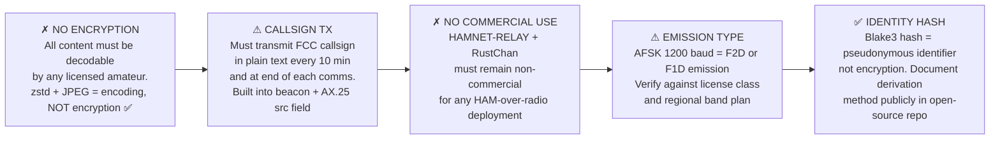

---

## Build Index Summary

| Build | Phase | Description | Key Test |
|-------|-------|-------------|----------|
| B01 | 1 | Serial port detection | CH340/CP2102 enumerated |
| B02 | 1 | Audio device enumeration | Default in/out found |
| B03 | 1 | AFSK tone generator | .wav audible + correct frequencies |
| B04 | 1 | AFSK demodulator | Decoded bits match input |
| **B05** | **2** | **Mic capture input stream** | **Tones decoded from mic** |
| **B06** | **2** | **Speaker output stream** | **Remote station decodes our TX** |
| **B07** | **2** | **VOX carrier sense via mic** | **Busy flag fires on signal** |
| **B08** | **2** | **🔑 Full mic/speaker loopback — Radio on Desk Mode** | **Any on-air packet decoded from mic alone** |
| B09 | 3 | AX.25 frame assembler | Direwolf accepts output |
| B10 | 3 | PTT control via RTS/DTR | PTT LED flashes |
| B11 | 3 | Packet TX pipeline | Remote decodes 'HELLO WORLD' |
| B12 | 3 | Packet RX pipeline | APRS packet decoded with callsign |
| B13 | 3 | Full TX/RX duplex test | PING/PONG round-trip |
| B14 | 4 | Client identity (Blake3) | Same hash on restart |
| B15 | 4 | MessagePack serialization | Round-trip struct match |
| B16 | 4 | zstd compression | 1KB → <200 bytes |
| B17 | 4 | Full payload codec pipeline | Post decoded at receiver |
| B18 | 5 | Channel carrier sense | Busy flag within 100ms |
| B19 | 5 | CSMA listen-before-transmit | No collision over 50 sends |
| B20 | 5 | Priority TX queue | HIGH priority transmitted first |
| B21 | 6 | Axum HTTP server | /health returns 200 |
| B22 | 6 | REST endpoints | All endpoints return correct JSON |
| B23 | 6 | WebSocket /subscribe | Real-time events on packet RX |
| B24 | 6 | TOML config system | Config persists across restart |
| B25 | 7 | CHIRP/Baofeng programming | Radio displays programmed freq |
| B26 | 7 | Band plan validation | Out-of-band freq triggers warning |
| B27 | 7 | Server beacon TX | Beacon decoded every 10 min |
| B28 | 7 | Client beacon RX + sync | Client auto-tunes within 30s |
| B29 | 7 | Full sync handshake | /peers shows client after handshake |
| B30 | 8 | Image quality tier system | Output within bandwidth budget |
| B31 | 8 | Image TX over radio | 64×64 received + reconstructed |
| B32 | 8 | Chunked file transfer | 10KB file transferred + hash match |
| B33 | 8 | ACK/NACK retransmit | 20% packet loss recovered |
| B34 | 8 | File reassembly + storage | File on disk matches original |
| B35 | 9 | RustChan incoming webhook | Post appears on board via curl |
| B36 | 9 | HAM source badge | 📻 badge on HAM posts |
| B37 | 9 | Thread watch/subscription API | TX queued on new watched post |
| B38 | 9 | Outbound TX hook | TX queue item on HAM board submit |
| B39 | 9 | RustChan admin config panel | Disabling board stops TX hook |
| B40 | 9 | Callsign/identity association | Callsign in AX.25 source field |
| B41 | 10 | WS push relay→RustChan | Post appears within seconds |
| **B42** | **10** | **🔑 Full streaming pipeline end-to-end** | **Remote post on board within 10s** |
| B43 | 10 | Image quality tier awareness | Large image auto-downscaled |
| B44 | 10 | Radio status widget | Disconnect shows within 10s |
| B45 | 10 | Offline/radio-only mode | Only HAM posts visible |
| B46 | 11 | Digipeater --mode=relay | Packet repeated for out-of-range station |
| B47 | 11 | Routing table + neighbor beacons | Optimal path selected |
| B48 | 11 | Store-and-forward | Delayed packet delivered within TTL |
| **B49** | **11** | **🏁 Multi-hop end-to-end mesh test** | **Out-of-range post on RustChan board** |

---

*HAMNET-RELAY · Architecture Build Roadmap · PRE-DEVELOPMENT DRAFT · 73 DE HAMNET*
